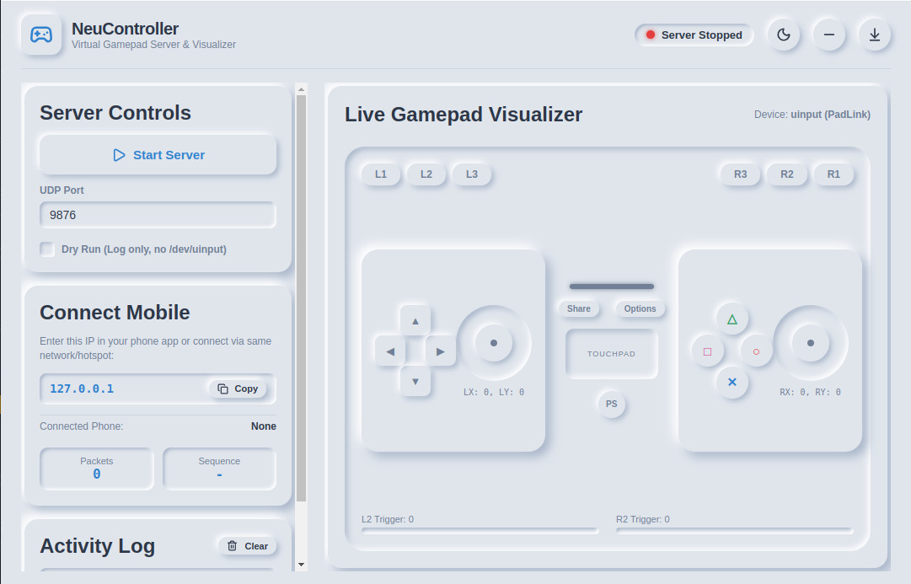
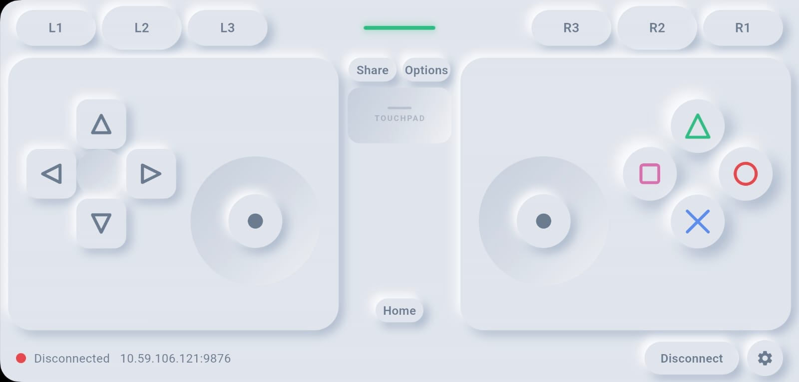

# NeuController — Phone as a Gamepad & Desktop Controller Manager

NeuController mengubah smartphone Android Anda menjadi virtual gamepad berlatensi rendah untuk PC/Laptop Linux. Input kontroler dikirim melalui UDP (60 Hz) secara realtime dan diterjemahkan menjadi virtual controller menggunakan Linux `uinput`, dilengkapi aplikasi Desktop GUI Neumorphic berbasis Electron untuk monitoring dan kontrol penuh.

```
[Phone: Flutter App] --- UDP (Port 9876) ---> [Laptop: Electron / Python Server] ---> [Virtual Gamepad /dev/uinput] ---> Games
```

---

## 📸 Screenshots & Preview

| Desktop Manager (Electron GUI) | Mobile Controller (Flutter App) |
|:---:|:---:|
|  |  |

---

## ⚡ Quick Startup Guide

### 0. Persiapan Izin Linux (Satu Kali Setup)
Agar server dapat membuat virtual controller tanpa memerlukan akses `root` (`sudo`) setiap saat, berikan izin akses `/dev/uinput`:

```bash
# Tambahkan user Anda ke grup input
sudo usermod -aG input $USER

# Berikan izin write ke /dev/uinput (atau pasang udev rule)
sudo chmod 660 /dev/uinput && sudo chgrp input /dev/uinput

# Izinkan port UDP di firewall jika aktif
sudo ufw allow 9876/udp
```
> **Catatan:** Setelah menjalankan `usermod`, lakukan log out lalu log in kembali agar perubahan grup aktif.

---

### 1. Jalankan Desktop / Server (Pilih salah satu)

#### 🌟 Pilihan A: Menggunakan Desktop App (Electron GUI) — *Direkomendasikan*
Aplikasi desktop menyediakan UI interaktif Neumorphic, otomatis menjalankan Python server di background, visualizer tombol live, tombol minimize ke system tray, serta indikator IP & status koneksi.

```bash
cd electron
npm install
npm start
```

#### 💻 Pilihan B: Menggunakan CLI / Headless Server (Terminal)
Jika Anda hanya ingin menjalankan server via terminal tanpa GUI:

```bash
cd server
python3 -m venv .venv && source .venv/bin/activate
pip install -r requirements.txt
python server.py --port 9876
```
*(Catatan: Anda dapat menambahkan opsi `--dry-run` untuk testing jaringan tanpa membuat virtual device hardware).*

---

### 2. Jalankan Mobile App

#### 📱 Opsi 1: Download Langsung APK (Tanpa Build)
Unduh file APK siap pakai dari halaman [GitHub Releases](https://github.com/brenandacaesa/neu-controller/releases).
1. Download `neu-controller-*.apk` ke smartphone Anda.
2. Izinkan *"Install unknown apps"* pada browser/file manager dan pasang APK.
3. Buka **Neu Controller**, cari server laptop di daftar *Nearby servers* (atau masukkan IP laptop secara manual), lalu tap **Connect**.

#### 🛠️ Opsi 2: Jalankan dari Source Code (Flutter)
```bash
cd mobile
flutter pub get
flutter run
```

---

## ✨ Fitur Unggulan

- **Ultra-Low Latency UDP**: Pengiriman state controller 60 Hz dengan round-trip ping time monitor (<30 ms pada WiFi/Hotspot lokal).
- **Modern Neumorphism Dark Design**: Antarmuka estetis, konsisten, dan elegan baik pada aplikasi Android maupun Desktop.
- **Desktop Manager GUI**:
  - Dibuat dengan Electron & Lucide Icons.
  - Live Controller Visualizer (pergerakan joystick & tombol menyala realtime).
  - Background Process Management (start/stop server Python otomatis).
  - Minimize to System Tray & background running.
- **Full Gamepad Layout**: Dual analog sticks, D-pad, tombol aksi (Cross, Circle, Square, Triangle), L1/R1 bumpers, L2/R2 triggers, dan Start/Select.
- **Failsafe System**: Reset otomatis input controller jika koneksi terputus dalam 500 ms untuk mencegah stuck button.

---

## 🎮 Verifikasi Virtual Gamepad di Linux

Untuk memastikan sistem mengenali NeuController sebagai gamepad resmi:

```bash
# Periksa event input dengan evtest
sudo evtest
# Pilih "NeuController" atau "PadLink", lalu tekan tombol di HP untuk melihat event

# Atau menggunakan jstest
jstest /dev/input/js0
```

---

## 🔧 Troubleshooting

| Kendala | Penyebab Umum | Solusi |
|---|---|---|
| Server tidak terdeteksi di Mobile | WiFi client isolation (pada WiFi publik/kampus) | Gunakan fitur Personal Hotspot dari HP ke laptop, atau masukkan IP manual yang tertera di desktop app |
| Status koneksi merah / Ping timeout | Firewall laptop memblokir traffic UDP | Jalankan `sudo ufw allow 9876/udp` |
| `Cannot open /dev/uinput: Permission denied` | User belum memiliki hak akses ke device uinput | Jalankan `sudo chmod 660 /dev/uinput && sudo chgrp input /dev/uinput` atau tambahkan user ke grup `input` |
| Server crash saat start tanpa dry-run | Device `/dev/uinput` tidak dapat diakses | Berikan izin `/dev/uinput` seperti di atas atau jalankan mode `--dry-run` jika hanya mengetes konektivitas |
| Tombol terasa delay / lag | Interferensi frekuensi WiFi 2.4 GHz | Gunakan tethering Hotspot HP 5 GHz ke laptop |

---

## 📂 Struktur Repositori

```
neu-controller/
├── electron/          # Desktop Manager UI (Electron, Lucide Icons, IPC)
├── mobile/            # Mobile Gamepad App (Flutter, Neumorphic UI, UDP Client)
├── server/            # Backend Virtual Controller (Python, uinput/python-uinput)
├── image/             # Screenshot & preview aset dokumentasi
└── documentation/     # Spesifikasi teknis, PRD, dan panduan arsitektur
```

---

## 👤 Author & Maintainer
- **Author**: Brenanda Caesa Pamudya
- **Email**: brenandapamudya178@gmail.com
- **Repository**: [github.com/brenandacaesa/neu-controller](https://github.com/brenandacaesa/neu-controller)
